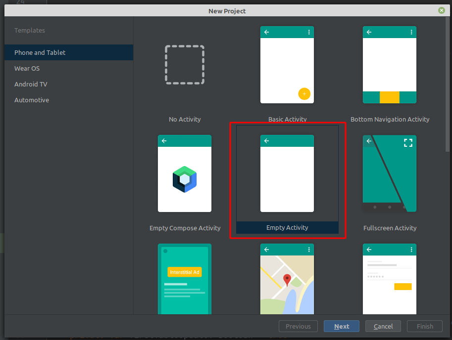
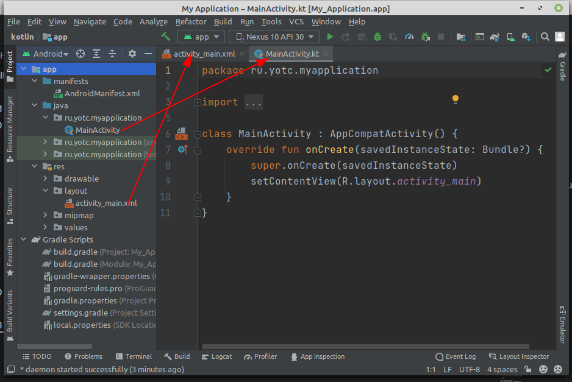
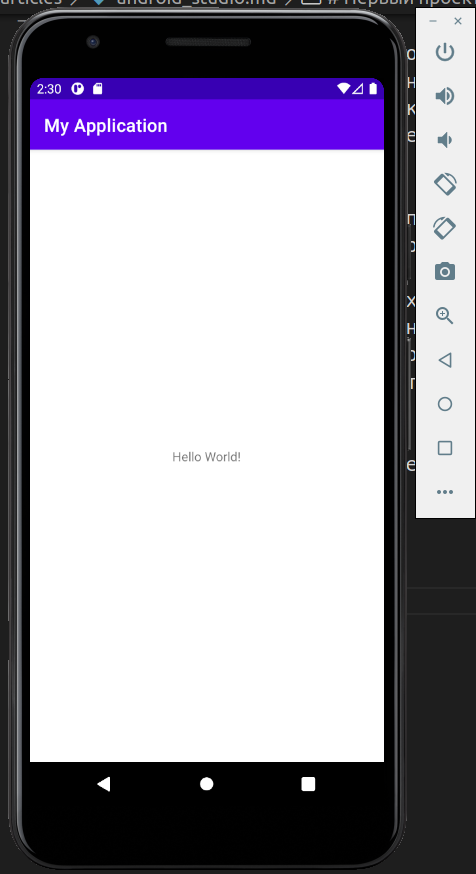
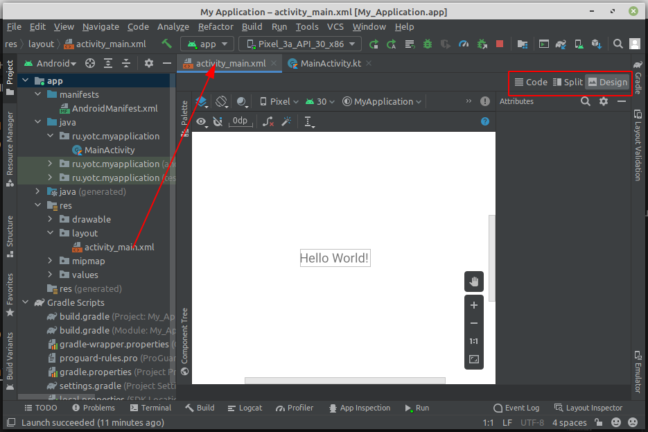
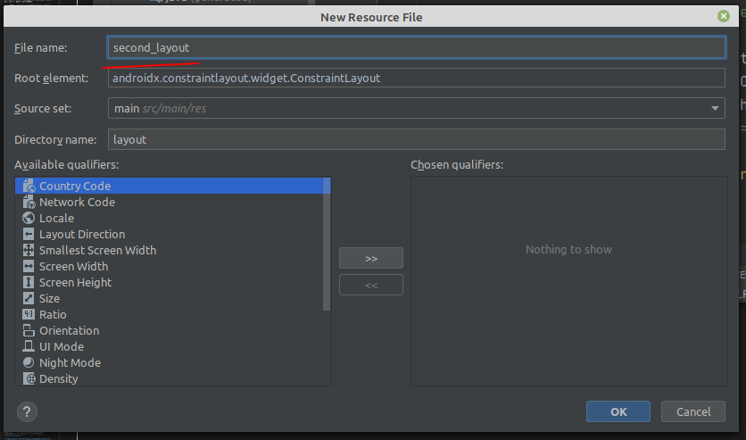
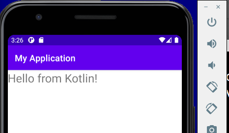

<table style="width: 100%;"><tr><td style="width: 40%;">
<a href="../articles/kotlin.md">основы Kotlin
</a></td><td style="width: 20%;">
<a href="../readme.md">Содержание
</a></td><td style="width: 40%;">
<a href="../articles/themes.md">Темы. Фигуры. Обработчики событий.
</a></td><tr></table>

# Первый проект в Android Studio

>Основано на [этих лекциях](https://metanit.com/java/android/1.2.php) (адаптировано под Kotlin)

## Создание первого приложения, структура проекта

Cоздадим первое приложение в среде Android Studio для операционной системы Android. Откроем Android Studio и на начальном экране выберем пункт New Project (либо, если какой-то проект уже открыт, через главное меню File - New Project)

При создании проекта Android Studio вначале предложит нам выбрать шаблон проекта:

>Внешний вид может немного отличаться, т.к. я пишу лекции под Linux



Android Studio предоставляет ряд шаблонов для различных ситуаций. Выберем в этом списке шаблон Empty Activity, который предосавляет самый простейший фукционал, необходимый для начала, и нажмем на кнопку Next.

После этого отобразится окно настроек нового проекта:


В окне создания нового проекта мы можем установить его начальные настройки:

* В поле **Name** вводится название приложения.

* В поле **Package Name** указывается имя пакета, где будет размещаться главный класс приложения. В для тестовых проектов это значение не играет ольшого значения.

* В поле **Save Location** установливается расположение файлов проекта на жестком диске. Можно оставить значение по умолчанию.

* В поле **Language** указывается используемый язык программирования, по умолчанию в этом поле стоит Kotlin (поддерживается и Java).

* В поле **Minimum SDK** указывается самая минимальная поддерживаемая версия SDK. Оставим значение по умолчанию - API 21: Android 5.0 (Lollipop), которая означает, что наше приложение можно будет запустить начиная с Android 5.0, а это 94% устройств. На более старых устройствах запустить будет нельзя.

Стоит учитывать, что чем выше версия SDK, тем меньше диапазон поддерживаемых устройств.

Далее нажмем на кнопку Finish, и Android Studio создаст новый проект (процесс создания достаточно долгий):


Вначале вкратце рассмотрим структуру проекта, что он уже имеет по умолчанию



Проект Android может состоять из различных модулей. По умолчанию, когда мы создаем проект, создается один модуль - **app**. Модуль имеет три подпапки:

* **manifests**: хранит файл манифеста `AndroidManifest.xml`, который описывает конфигурацию приложения и определяет каждый из компонентов данного приложения.

* **java**: хранит файлы кода (всегда называется Java, хотя мы и пишем на Kotlin), которые структурированы по отдельным пакетам. Так, в папке ru.yotc.myapplication (название которого было указано на этапе создания проекта) имеется по умолчанию файл `MainActivity.kt` с кодом на языке Kotlin, который представляет класс MainActivity, запускаемый по умолчанию при старте приложения

* **res**: содержит используемые в приложении ресурсы. Все ресурсы разбиты на подпапки.

    * папка **drawable** предназначена для хранения изображений, используемых в приложении

    * папка **layout** предназначена для хранения файлов, определяющих графический интерфейс. По умолчанию здесь есть файл `activity_main.xml`, который определяет интерфейс для класса MainActivity в виде xml

    * папки **mipmap** содержат файлы изображений, которые предназначены для создания иконки приложения при различных разрешениях экрана.

    * папка **values** хранит различные xml-файлы, содержащие коллекции ресурсов - различных данных, которые применяются в приложении. По умолчанию здесь есть два файла и одна папка:

        * файл **colors.xml** хранит описание цветов, используемых в приложении

        * файл **strings.xml** содержит строковые ресурсы, используемые в приложении

        * папки **themes** хранит две темы приложения - для светлую (дневную) и темную (ночную)

Отдельный элемент **Gradle Scripts** содержит ряд скриптов, которые используются при построении приложения.

Во всей этой структуре следует выделить файл **MainActivity.kt**, который открыт в Android Studio и который содержит логику приложения и собственно с него начинается выполнение приложения. И также выделим файл **activity_main.xml**, который определяет графический интерфейс - по сути то, что увидит пользователь на своем устройстве после загрузки приложения.

## Запуск проекта

Созданный выше проект уже содержит некоторый примитивный функционал. Правда, этот функционал почти ничего не делает, только выводит на экран строку "Hello world!". Тем не менее это уже фактически приложение, которое мы можем запустить.

Для запуска и тестирования приложения мы можем использовать эмуляторы или реальные устройства. Но в идеале лучше тестировать на реальных устройствах. К тому же эмуляторы требуют больших аппаратных ресурсов, и не каждый компьютер может потянуть требования эмуляторов. А для использования мобильного устройства для тестирования может потребоваться разве что установить необходимый драйвер.

Запустим проект, нажав на зеленую стрелочку на панели инструментов.


И после запуска мы увидим наше приложение на экране, которое просто выводит на экран строку Hello World.



Но почему у нас выводится именно эта строка? Почему у нас вообще создается именно такой визуальный интерфейс?

Выполнение приложения Android по умолчанию начинается с класса **MainActivity**, который по умолчанию открыт в Android Studio:

```kt
package ru.yotc.myapplication

import androidx.appcompat.app.AppCompatActivity
import android.os.Bundle

class MainActivity : AppCompatActivity() {
    override fun onCreate(savedInstanceState: Bundle?) {
        super.onCreate(savedInstanceState)
        setContentView(R.layout.activity_main)
    }
}
```

Каждый отдельный экран или страница в приложении описывается таким понятием как **activity**. В литературе могут использоваться различные термины: экран, страница, активность. В данном случае я буду использовать понятие "activity". Так вот, если мы запустим приложение, то на экране мы по сути увидим определенную activity, которая предсталяет данный интерфейс.

Класс **MainActivity** по сути представляет обычный класс, в начале которого идет определение пакета данного класса:

```kt
package ru.yotc.myapplication
```

Далее идет импорт классов из других пакетов, функциональность которых используется в MainActivity:

```kt
import androidx.appcompat.app.AppCompatActivity
import android.os.Bundle
```

По умолчанию **MainActivity** наследуется от класса **AppCompatActivity**, который выше подключен с помощью директивы импорта. Класс **AppCompatActivity** по сути представляет отдельный экран (страницу) приложения или его визуальный интерфейс. И **MainActivity** наследует весь этот функционал.

По умолчанию **MainActivity** содержит только один метод *onCreate()*, в котором фактически и создается весь интерфейс приложения:

```kt
override fun onCreate(savedInstanceState: Bundle?) {
    super.onCreate(savedInstanceState)
    setContentView(R.layout.activity_main)
}
```

В метод *setContentView()* передается ресурс разметки графического интерфейса:

```kt
setContentView(R.layout.activity_main)
```

Именно здесь и решается, какой именно визуальный интерфейс будет иметь **MainActivity**. Но что в данном случае представляет ресурс **R.layout.activity_main**? Это файл `activity_main.xml` из папки `res/layout` (в принципе можно заметить, что название ресурса соответствует названию файла), который также по умолчанию открыт в Android Studio:



## Файл activity_main.xml

Android Studio позволяет работать с визуальным интерфейсом как в режиме кода, так и в графическом режиме. Так, по умолчанию файл открыт в графическом режиме, и мы наглядно можем увидеть, как у нас примерно будет выглядеть экран приложения. И даже набросать с панели инструментов какие-нибудь элементы управления, например, кнопки или текстовые поля.

Но также мы можем работать с файлом в режиме кода, поскольку `activity_main.xml` - это обычный текстовый файл с разметкой xml. Для переключения к коду нажмём на кнопку **Code** над графическим представлением. (Дополнительно с помощью кнопки **Split** можно переключиться на комбинированное представление код + графический дизайнер)

Здесь мы увидим, что на уровне кода файл **activity_main.xml** содержит следующую разметку:

```xml
<?xml version="1.0" encoding="utf-8"?>
<androidx.constraintlayout.widget.ConstraintLayout xmlns:android="http://schemas.android.com/apk/res/android"
    xmlns:app="http://schemas.android.com/apk/res-auto"
    xmlns:tools="http://schemas.android.com/tools"
    android:layout_width="match_parent"
    android:layout_height="match_parent"
    tools:context=".MainActivity">

    <TextView
        android:layout_width="wrap_content"
        android:layout_height="wrap_content"
        android:text="Hello World!"
        app:layout_constraintBottom_toBottomOf="parent"
        app:layout_constraintLeft_toLeftOf="parent"
        app:layout_constraintRight_toRightOf="parent"
        app:layout_constraintTop_toTopOf="parent" />

</androidx.constraintlayout.widget.ConstraintLayout>
```

Весь интерфейс представлен элементом-контейнером **androidx.constraintlayout.widget.ConstraintLayout**. ConstraintLayout позволяет расположить вложенные элементы в определенных местах экрана. 

Атрибут **android:layout_width** определяет ширину контейнера.

Значением атрибута android:layout_width является "match_parent". Это значит, что элемент (ConstraintLayout) будет растягиваться по всей ширине контейнера (экрана устройства).

Атрибут **android:layout_height="match_parent"** определяет высоту контейнера. Значение "match_parent" указывает, что ConstraintLayout будет растягивается по всей высоте контейнера (экрана устройства).

Атрибут **tools:context** определяет, какой класс activity (экрана приложения) связан с текущим определением интерфейса. В данном случае это класс **MainActivity**. Это позволяет использовать в Android Studio различные возможности в режиме дизайнера, которые зависят от класса activity.

Внутри контейнера **ConstraintLayout** расположен текстовый блок:

**TextView**

* **android:layout_width** устанавливает ширину виджета. Значение wrap_content задает для виджета величину, достаточную для отображения в контейнере.

* **android:layout_height** устанавливает высоту виджета. Значение wrap_content аналогично установке ширины задает для виджета высоту, достаточную для отображения в контейнере

* **android:text** устанавливает текст, который будет выводиться в TextView (в данном случае это строка "Hello World!")

* **app:layout_constraintLeft_toLeftOf="parent"**: указывает, что левая граница элемента будет выравниваться по левой стороне контейнера **ConstraintLayout**

* **app:layout_constraintTop_toTopOf="parent"**: указывает, что верхняя граница элемента будет выравниваться по верхней стороне контейнера **ConstraintLayout**

* **app:layout_constraintRight_toRightOf="parent"**: указывает, что правая граница элемента будет выравниваться по правой стороне контейнера ConstraintLayout

* **app:layout_constraintBottom_toBottomOf="parent"**: указывает, что нижняя граница элемента будет выравниваться по нижней стороне контейнера ConstraintLayout

Стоит отметить, что последние четыре атрибута вместе будут приводить к расположению **TextView** по центру экрана.

Таким образом, при запуске приложения сначала запускается класс **MainActivity**, который в качестве графического интерфейса устанавливает разметку из файла `activity_main.xml`. И поскольку в этой разметке прописан элемент **TextView**, который представляет некоторый текст, то мы и увидим его текст на экране.

## Определение интерфейса в файле XML. Файлы layout

Как правило, для определения визуального интерфейса в проектах под Android используются специальные файлы xml. Эти файлы являются ресурсами разметки и хранят определение визуального интерфейса в виде кода XML. Подобный подход напоминает создание веб-сайтов, когда интерфейс определяется в файлах html, а логика приложения - в коде javascript.

Объявление пользовательского интерфейса в файлах XML позволяет отделить интерфейс приложения от кода. Что означает, что мы можем изменять определение интерфейса без изменения кода. Например, в приложении могут быть определены разметки в файлах XML для различных ориентаций монитора, различных размеров устройств, различных языков и т.д. Кроме того, объявление разметки в XML позволяет легче визуализировать структуру интерфейса и облегчает отладку.

Файлы разметки графического интерфейса располагаются в проекте в каталоге `res/layout`. По умолчанию при создании проекта с пустой activity уже есть один файл ресурсов разметки **activity_main.xml**

В файле определяются все графические элементы и их атрибуты, которые составляют интерфейс. При создании разметки в XML следует соблюдать некоторые правила: каждый файл разметки должен содержать один корневой элемент, который должен представлять объект **View** или **ViewGroup**.

В нашем случае корневым элементом является элемент **ConstraintLayout**, который содержит элемент **TextView**.

При компиляции каждый XML-файл разметки компилируется в ресурс View. Загрузка ресурса разметки осуществляется в методе Activity.onCreate. Чтобы установить разметку для текущего объекта activity, надо в метод setContentView() в качестве параметра передать ссылку на ресурс разметки.

```kt
setContentView(R.layout.activity_main)
```

Для получения ссылки на ресурс в коде необходимо использовать выражение `R.layout.[название_ресурса]`. Название ресурса layout будет совпадать с именем файла.

Но у нас может быть и несколько различных ресурсов layout. Как правило, каждый отдельный класс Activity использует свой файл layout. Либо для одного класса Activity может использоваться сразу несколько различных файлов layout.

### Добавление файла layout

К примеру, добавим в проект новый файл разметки интерфейса. Для этого нажмем на папку `res/layout` правой кнопкой мыши и в появившемся меню выберем пункт **New -> Layout Resource File**

После этого в специальном окошке будет предложено указать имя и корневой элемент для файла layout:



В качестве названия укажем *second_layout*. Все остальные настройки оставим по умолчанию:

* в поле **Root element** указывается корневой элемент. По умолчанию это androidx.constraintlayout.widget.ConstraintLayout.

* поле **Source set** указывает, куда помещать новый файл. По умолчанию это main - область проекта, с которой мы собственно работаем при разаботке приложения.

* поле **Directory name** указывает папку в рамках каталога, выбранного в предыдущей опции, в который собственно помещается новый файл. По умолчанию для файлов с разметкой интерфейса это layout.

После этого в папку `res/layout` будет добавлен новый файл **second_layout.xml**, с которым мы можем работать точно также, как и с **activity_main.xml**.

При создании он содержит только корневой элемент:

```xml
<?xml version="1.0" encoding="utf-8"?>
<androidx.constraintlayout.widget.ConstraintLayout xmlns:android="http://schemas.android.com/apk/res/android"
    android:layout_width="match_parent"
    android:layout_height="match_parent">

</androidx.constraintlayout.widget.ConstraintLayout>
```

Добавим в него текстовое поле:

```xml
<TextView
    android:id="@+id/header"
    android:text="Welcome to Android"
    android:textSize="26sp"
    android:layout_width="match_parent"
    android:layout_height="match_parent" />
```

Здесь определено текстовое поле **TextView**, которое имеет следующие атрибуты:

* **android:id** - идентификатор элемента, через который мы сможем ссылаться на него в коде. В записи *android:id="@+id/header"* символ @ указывает XML-парсеру использовать оставшуюся часть строки атрибута как идентификатор. А знак + означает, что если для элемента не определен id со значением header, то его следует определить.

* **android:text** - текст элемента - на экран будет выводиться строка "Welcome to Android".

* **android:textSize** - высота шрифта (здесь 26 единиц)

* **android:layout_width** - ширина элемента. Значение "match_parent" указывает, что элемент будет растягиваться по всей ширине контейнера ConstraintLayout

* **android:layout_height** - высота элемента. Значение "match_parent" указывает, что элемент будет растягиваться по всей высоте контейнера ConstraintLayout

Применим этот файл в качестве определения графического интерфейса в классе MainActivity:

```kt
override fun onCreate(savedInstanceState: Bundle?) {
    super.onCreate(savedInstanceState)
    // setContentView(R.layout.activity_main)
    setContentView(R.layout.second_layout)
}
```

Файл интерфейса называется `second_layout.xml`, поэтому по умолчанию для него будет создаваться ресурс **R.layout.second_layout**. Соответственно, чтобы его использовать, мы передаем его в метода setContentView. В итоге мы увидим на экране следующее:


### Получение и управлене визуальными элементами в коде

Выше определенный элемент **TextView** имеет один очень важный атрибут - **id** или **идентификатор элемента**. Этот идентификатор позволяет обращаться к элементу, который определен в файле xml, из кода. Например, перейдем к классу MainActivity и изменим его код:

```kt
...
setContentView(R.layout.second_layout)

val textView = findViewById<TextView>(R.id.header)
textView.text = "Hello from Kotlin!"
```

Для получения элементов по **id** класс Activity имеет метод *findViewById()*. В этот метод передается идентификатор ресурса в виде `R.id.[идентификатор_элемента]`. Этот метод возвращает объект **View** - объект базового класса для всех элементов, поэтому результат метода еще необходимо привести к типу **TextView**.

Выше мы приводили тип указывая нужный в угорвых скобках метода, но можно явно определить тип переменной:

```kt
val textView: TextView = findViewById(R.id.header)
```

Далее мы можем что-то сделать с этим элементом, в данном случае изменяем его текст.

Причем что важно, получение элемента происходит после того, как в методе setContentView была установлена разметка, в которой этот визуальный элемент был определен.

И если мы запустим проект, то увидим, что TextView выводит новый текст:



### Определение размеров

При разработке приложений под Android мы можем использовать различные типы измерений:

* px: пиксели текущего экрана. Однако эта единица измерения не рекомендуется, так как реальное представление внешнего вида может изменяться в зависимости от устройства; каждое устройство имеет определенный набор пикселей на дюйм, поэтому количество пикселей на экране может также меняться

* dp: (device-independent pixels) независимые от плотности экрана пиксели. Абстрактная единица измерения, основанная на физической плотности экрана с разрешением 160 dpi (точек на дюйм). В этом случае 1dp = 1px. Если размер экрана больше или меньше, чем 160dpi, количество пикселей, которые применяются для отрисовки 1dp соответственно увеличивается или уменьшается. Например, на экране с 240 dpi 1dp=1,5px, а на экране с 320dpi 1dp=2px. Общая формула для получения количества физических пикселей из dp: px = dp * (dpi / 160)

* sp: (scale-independent pixels) независимые от масштабирования пиксели. Допускают настройку размеров, производимую пользователем. Рекомендуются для работы со шрифтами.

* pt: 1/72 дюйма, базируются на физических размерах экрана

* mm: миллиметры

* in: дюймы

Предпочтительными единицами для использования являются **dp**. Это связано с тем, что мир мобильных устройств на Android сильно фрагментирован в плане разрешения и размеров экрана.

### Ширина и высота элементов

Все визуальные элеметы, которые мы используем в приложении, как правило, упорядочиваются на экране с помощью контейнеров. В Android подобными контейнерами служат такие классы как **RelativeLayout**, **LinearLayout**, **GridLayout**, **TableLayout**, **ConstraintLayout**, **FrameLayout**. Все они по разному располагают элементы и управляют ими, но есть некоторые общие моменты при компоновке визуальных компонентов, которые мы сейчас рассмотрим.

Для организации элементов внутри контейнера используются параметры разметки. Для их задания в файле xml используются атрибуты, которые начинаются с префикса layout_. В частности, к таким параметрам относятся атрибуты **layout_height** и **layout_width**, которые используются для установки размеров и могут использовать одну из следующих опций:

* Растяжение по всей ширине или высоте контейнера с помощью значения **match_parent** (для всех контейнеров кроме ConstraintLayout) или 0dp (для ConstraintLayout)

* Растяжение элемента до тех границ, которые достаточны, чтобы вместить все его содержимое с помощью значения **wrap_content**

* Точные размеры элемента, например 96 dp

**match_parent**

Установка значения **match_parent** позволяет растянуть элемент по всей ширине или высоте контейнера. Стоит отметить, что данное значение применяется ко всем контейнерам, кроме ConstraintLayout. Например, рястянем элемент TextView по всей ширине и высоте контейнера LinearLayout:

```xml
<?xml version="1.0" encoding="utf-8"?>
<LinearLayout
    xmlns:android="http://schemas.android.com/apk/res/android"
    android:layout_width="match_parent"
    android:layout_height="match_parent">
 
    <TextView
        android:layout_width="match_parent"
        android:layout_height="match_parent"
        android:text="Hello World!"
        android:textSize="30sp"
        android:background="#e0e0e0" />
     
</LinearLayout>
```

Контейнер самого верхнего уровня, в качестве которого в данном случае выступает **LinearLayout**, для высоты и ширины имеет значение **match_parent**, то есть он будет заполнять всю область для activity - как правило, весь экран.

И **TextView** также принимает подобные атрибуты. Значение **android:layout_width="match_parent"** обеспечивает растяжение по ширине, а **android:layout_height="match_parent"** - по вертикали. Для наглядности в **TextView** применяет атрибут **android:background**, который задает фон элемента и в данном случае окрашивает фон в цвет "#e0e0e0", благодаря чему мы можем увидеть занимаемую им область.


**wrap_content**

Значение **wrap_content** устанавливает те значения для ширины или высоты, которые необходимы, чтобы разместить на экране содержимое элемента:


## Внутренние и внешние отступы

Параметры разметки позволяют задать отступы как от внешних границ элемента до границ контейнера, так и внутри самого элемента между его границами и содержимым.

**Padding**

Для установки внутренних отступов применяется атрибут **android:padding**. Он устанавливает отступы контента от всех четырех сторон контейнера. Можно устанавливать отступы только от одной стороны контейнера, применяя следующие атрибуты: **android:paddingLeft**, **android:paddingRight**, **android:paddingTop** и **android:paddingBottom**.

Стоит отметить, что вместо атрибутов **android:paddingLeft** и **android:paddingRight** можно применять атрибуты **android:paddingStart** и **android:paddingEnd**, которые разработаны специально адаптации приложения для работы как для языков с левосторонней ориентацией, так и правосторонней ориентацией (арабский, фарси).

**Margin**

Для установки внешних отступов используется атрибут **layout_margin**. Данный атрибут имеет модификации, которые позволяют задать отступ только от одной стороны: **android:layout_marginBottom**, **android:layout_marginTop**, **android:layout_marginLeft** и **android:layout_marginRight**.

Дальше ссылки на несколько оригинальных лекций

## [ConstraintLayout](https://metanit.com/java/android/3.8.php)

## [Размеры элементов в ConstraintLayout](https://metanit.com/java/android/3.7.php)

## [Цепочки элементов в ConstraintLayout](https://metanit.com/java/android/3.15.php)

## [LinearLayout](https://metanit.com/java/android/3.2.php)

На этом пока с теорией закончим.

Практическое задание:

Используя **LinearLayout** нарисовать разметку для калькулятора (за основу взять калькулятор Windows)

<table style="width: 100%;"><tr><td style="width: 40%;">
<a href="../articles/kotlin.md">основы Kotlin
</a></td><td style="width: 20%;">
<a href="../readme.md">Содержание
</a></td><td style="width: 40%;">
<a href="../articles/themes.md">Темы. Фигуры. Обработчики событий.
</a></td><tr></table>